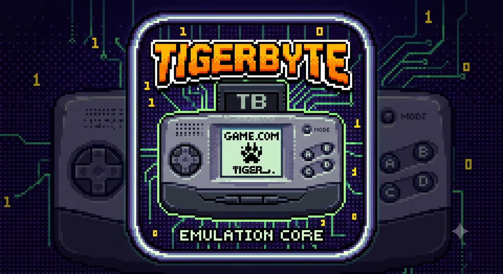

# Tigerbyte

A work-in-progress [libretro](https://www.libretro.com/) core emulating the
**Tiger Game.com** (1997) — Tiger Electronics' cartridge-based handheld with a
Sharp SM8521 CPU, a 200×160 grayscale LCD, and a resistive touchscreen.

Because it's a libretro core, Tigerbyte runs in libretro frontends — it's being
built for **Emutastic** — across desktop and mobile. On a touchscreen device,
your finger maps directly to the stylus.

## Status

Early development, built from the hardware up. Not yet playable — see the
roadmap. The CPU core comes first, validated in isolation before anything is
wired together.

## Building

Requires a C99 compiler.

- **Windows (MSYS2 mingw64):** `mingw32-make`
- **Linux:** `make platform=unix`

Produces `tigerbyte_libretro.dll` / `tigerbyte_libretro.so`; load it as a core
in your libretro frontend.

## System files

Booting requires the console's original system ROM image(s), which are not
included with the core. Place your own copies in your frontend's system directory.

## License

Intended to be permissively licensed (MIT). Emulation is written from
manufacturer documentation and clean-room reference; no GPL emulator code is
incorporated.
